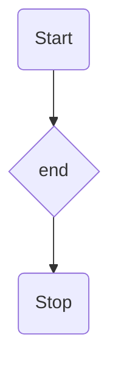
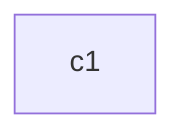

```mermaid  
flowchart TB
	id1(Start) --> id2{end} --> id3(Stop)
```

>[!question] ***WAP to input a number and check if number is even or odd, use structured english/[[Pseudocode]]/python/flowchart***

``` mermaid
flowchart TB
c1
```
