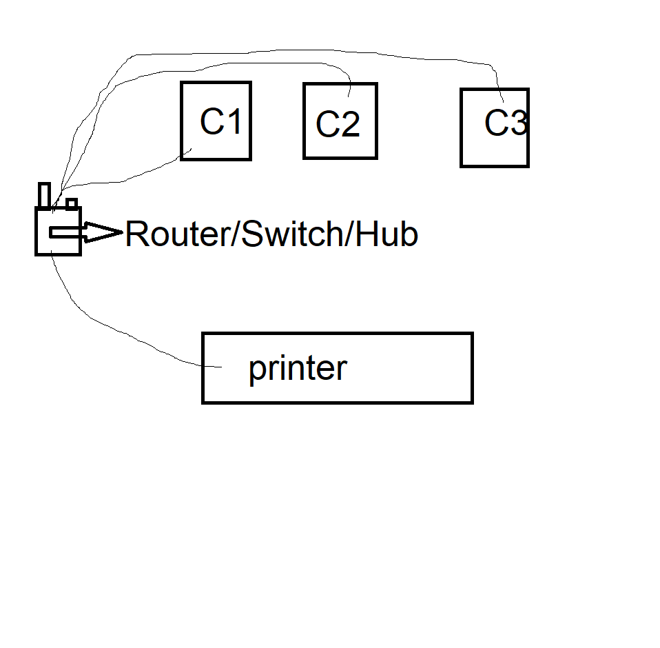
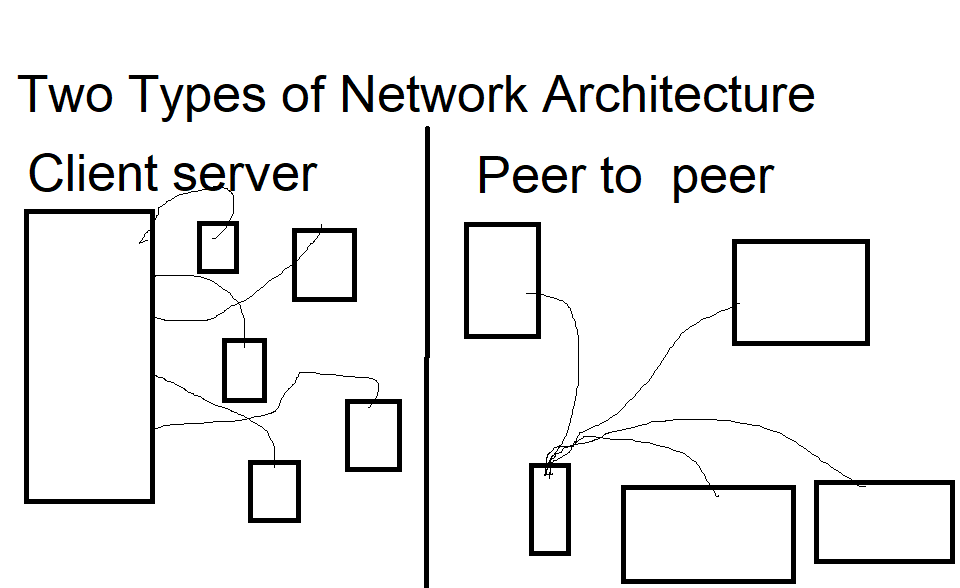
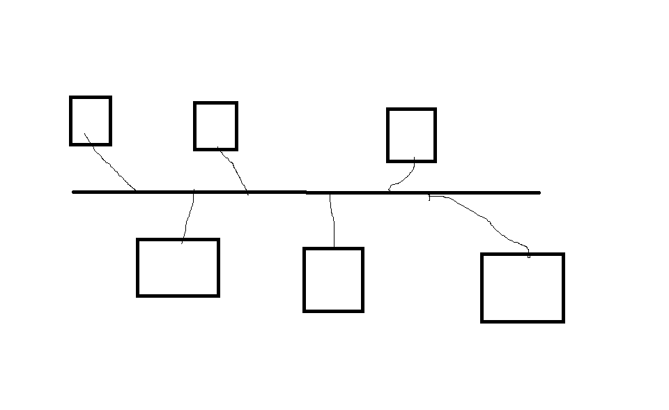
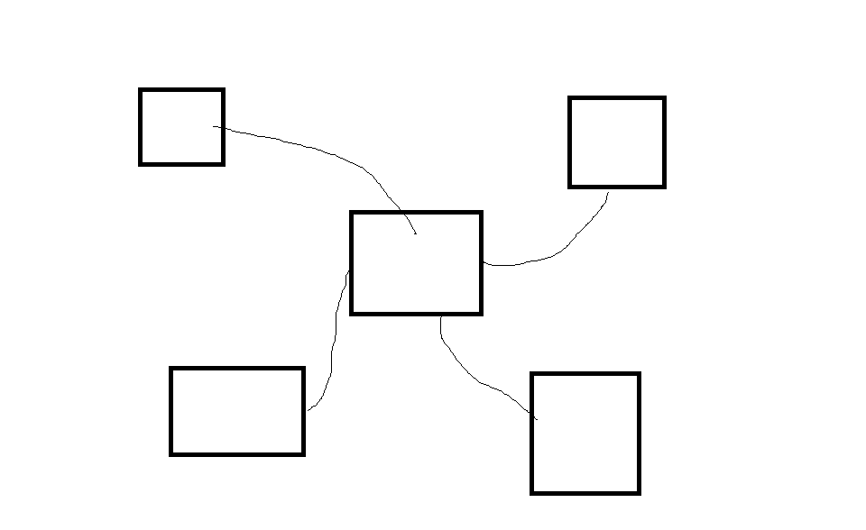
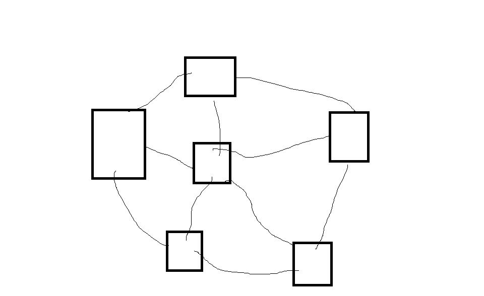
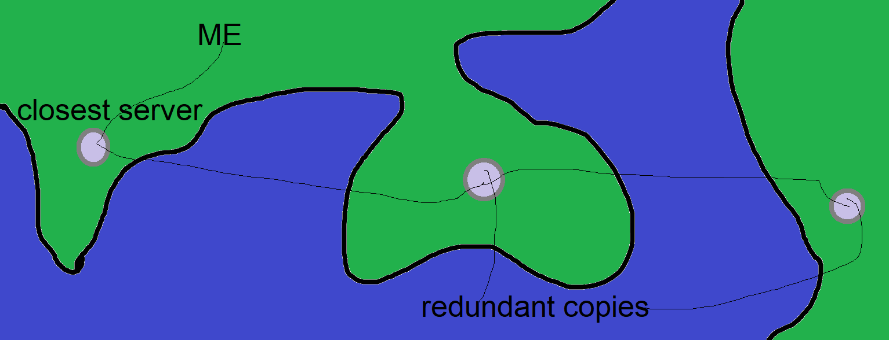

#cs #networking
## Network
Basic simple network

 | | 
--|--|--
L  |  AN  |  Large area network
M  |  AN  |  Metropolitan area network
W  |  AN  |  Wide area network

## Network Architecture

Client server: - 1 server to which many clients connect and get controlled by
Peer to Peer:- each computer has equal rights

## Network Topology
3 topologies:
### _Bus topology:_

### _Star topology:_

### Mesh topology:

## Cloud Network

Stores your data in many places

## Transmission media
2 Types:

guided | unguided
-- | --
Co-axial | 
Twisted Pair| Radio waves
Fibre Optic | Micro waves
### Twisted pair
2 types
shielded and unshielded
(shield used to prevent interception)
 

